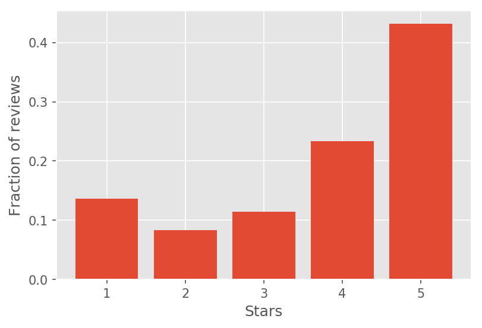
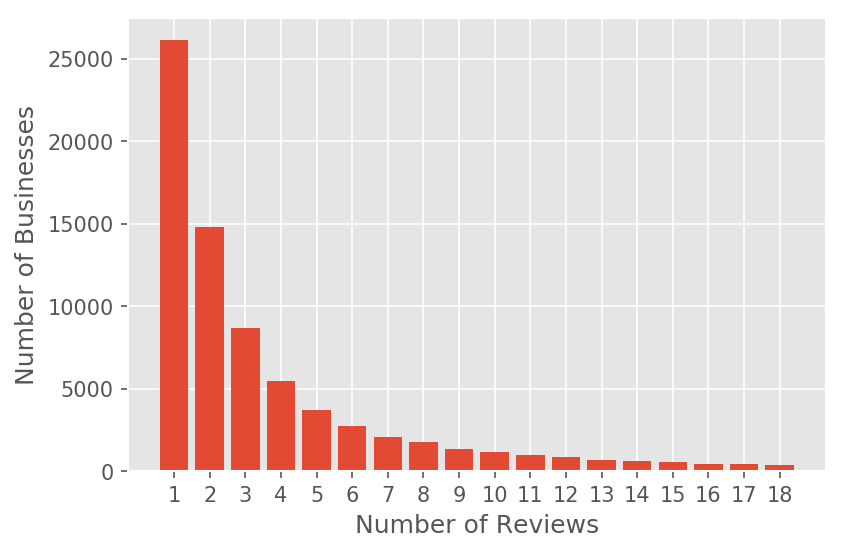
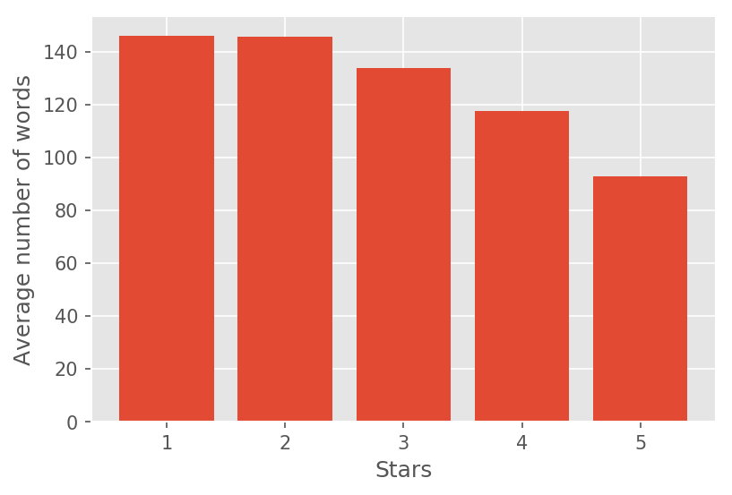
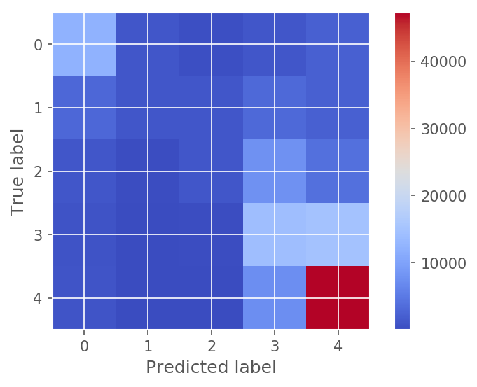
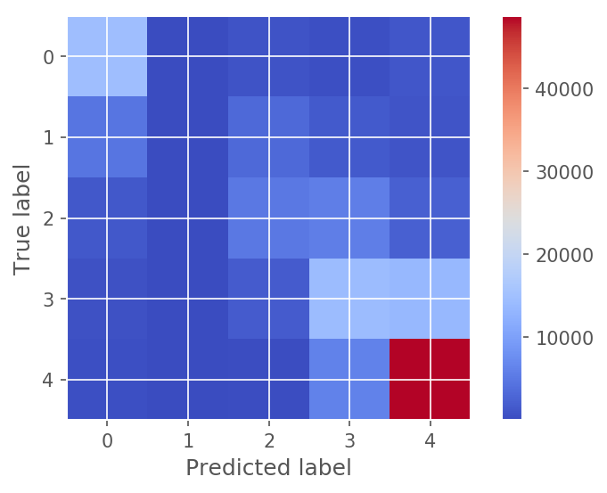

# Abstract

Quantifying social media opinion is a growing field of interest with the surge in use of smartphones and location services. Today public opinions on online platforms serve the purpose of publicity by word of mouth albiet in a much broader and widespread way. Hence, it is of prime interest for businesses to have a good idea of public opinion about their services to be able to improve and get more profitable.  

In this project, I have analyzed reviews posted by people on the popular platform [**Yelp**](http://yelp.com) to see how well textual reviews for different businesses/restaurants can be quantified. The availability of star ratings along with textual reviews in case of Yelp allows me to train a supervised machine learning model which can then be used to predict a numerical representation of a given unseen textual review on a scale of 1 to 5. All the steps required from obtaining the data in its raw form to the final trained model have been outlined in this document.

***

# 1 Data

The dataset used for the project is obtained from Yelp through their popular [Yelp Dataset Challenge](http://www.yelp.com/dataset_challenge). This is an annual competition that Yelp runs where it asks participants to come up with new insights from its real-world data. The challenge is currently in its 9th Round and it's a very rich source of text data that has been sourced from millions of anonymous users. This round also contains photos posted by users along with their reviews. These photos could potentially be analysed along with the text in the reviews to see the correlation of objects in the images with the main topics in the review text. However, this is beyond the scope of this project and I only focus on the reviews for this work.

## Data Description

The dataset includes a plethora of information about local businesses in 11 cities across 4 countries. This is a very rich textual data source which can be mined for numerous insights about users and businesses. The following are key attributes of the dataset:  

* 4.1M reviews and 947K tips by 1M users for 144K businesses
* 1.1M business attributes, e.g., hours, parking availability, ambience.
* Aggregated check-ins over time for each of the 125K businesses
* 200,000 pictures from the included businesses  

It includes information across the following cities:  

* U.K.: Edinburgh
* Germany: Karlsruhe
* Canada: Montreal and Waterloo
* U.S.: Pittsburgh, Charlotte, Urbana-Champaign, Phoenix, Las Vegas, Madison, Cleveland

## Data challenges/processing

The huge dataset brings with itself several challenges to start the analysis. All the data is in an unusual `json` format instead of a usual tabular format. For example, in case of the reviews, the data looks like:  

{  
`review_id`: (encrypted review id),  
`business_id`: (encrypted business id),  
`user_id`: (encrypted user id),  
`stars`: (star rating, rounded to integer-stars),  
`text`: (review text),  
`date`: (date, formatted like `2012-03-14`),  
`useful`: number of useful votes received,  
`funny`: number of funny votes received,  
`cool`: number of cool review votes received,  
`type`: review  
}  

For the purposes of this project, I decided to look only at the reviews for US based businesses. This would allow consistency and avoid varying languages across reviews - for example, German in Karlsruhe and French in Canada. However, as visible above, the reviews dataset has no information about the country where the business is located.  

Thankfully the source also includes a dataset about the characteristics of the businesses for which the reviews have been given. Although this also doesn't have explicit information about the country of the business. There is information about the latitude and longitude for each business however. Using something like Google Maps API allows to get location information but there is a constraint on the number of requests and I could not retrieve information about all 144K businesses. Hence, I ended up using `reverse_geocoder` package in python which allows to do a reverse lookup offline.  

Using this method, I got a list of all unique encrypted business ids which are based in the US. This allowed me to discard all entries where the business id was not a member of this list when reading in the reviews dataset.  

Now I have a subset of all the reviews which includes the review text and star ratings for all the US based businesses in this dataset challenge. However, I decide to work with only 20% of this subset of data to keep things manageable and be able to run all the required analysis on my laptop without needing a more powerful cloud based instance. For this purpose, I randomly read in lines from the reviews json file and make a dataset with ~500,000 reviews and their ratings.

# 2 Question

The main question I want to answer here is that how well can textual reviews be quantified to obtain a numeric measure of a person's opinion. This is of great importance as a numeric measure is immensely easier to understand and take action on as compared to a long list of words which requires significant time and energy to make sense of.   

### Implications  

This is surely a widely applied idea already in the world and I wanted to use this project as a platform to learn more about this process and get hands-on experience. The implications of this idea are prevalent across social sciences. A lot of Randomized Control Trials (RCTs) involve getting descriptive responses from participants. A well trained model can be used to quantify these descriptive responses to run regressions.  
This idea is often used by companies to quantify general social media opinion (for example, using tweets about several brands to compare customer satisfaction).    

While predicting yelp star ratings is just one example exercise, this same idea can be taken to many scenarios. A model trained on a separate dataset can be used to quantify people's political inclinations (eg. Democrats to Republicans on a scale of -5 to +5) from their posts/articles/emails etc.  
It tells us the most important and meaningful words which are strong predictors of a desired characteristic. Other implications include the ability to infer a general scale of opinion from a bunch of articles about a topic. Such an analysis on product reviews for instance can give a quick overview of what's the general opinion and what's the distribution across opinions. In university or work feedback forms as well such analyses can serve the purpose of getting a quantified representation of texts.  

### Explorations

In this particular scenario for Yelp, it's well known that the star ratings of businesses influence people significantly when making a choice among all available businesses. Consumers tend to choose the one with higher stars as an assurance of the quality of service they expect to receive. In a Yelp search, a star rating is arguably the first influence on a user's judgment. Hence, being able to get a prediction for the star ratings based on comments from any opinion on the business is surely very valuable for sales and I try to explore this possibility here.

\newpage

# 3 Extracting Content
Extracting content from this raw data involved several different steps which are mentioned in this section.  

## a. Exploratory analysis

As mentioned above, the first step even before pre-processing involved selecting only the reviews which are for US based businesses and filtering out the rest. This step is essential to make sure I am only dealing with English and not a mixture of several languages which can have an ill-effect on the model. I select a random subset of 20% of the reviews after the filtering.  

This leaves me with a dataset of review texts and corresponding star ratings for each review. The following plot shows the distribution of ratings across all reviews:

{ width=35% }

Next, let us look at the number of reviews received by each business. The following plot shows that most businesses receive just 1 or 2 reviews and the rate of growth is very slow. This emphasises the importance of being able to quantify texts from other sources about the business. However, one must remember that this is not the full dataset (it's only a 20% sample), so the actual numbers can be expected to be a bit higher. However, it will also increase the total number of businesses and I expect the pattern to remain the same.

{ width=45% }  

The next figure looks at the variation in review length based on the number of stars given by the user. We can see that 5 star reviews generally tend to be shorter in length. However, the fact that there is good consistency in length of reviews across reviews is an indication that our predictive model will get enough data for each class.

{ width=50% }

## b. Pre-processing the raw text
After the exploratory analysis, I need to clean and process the text to make it read for analysis. As studied during the course, I plan to use a **bag-of-words** representation of the text for modeling. This involves the following steps:  

* Removing punctuation and non-alphabetical characters from the text:  
A lot of documents have punctuations and numbers which are not informative and need to be removed for desired tokenization. This is done using a regular expression matching which filters out all words which are made of non-alphabetic characters. This way I get rid of all kinds of special characters, punctuations and numbers in the reviews.  

* Tokenization of cleaned reviews to get each word of the review as a unique element:  
Tokenizing the reviews gives a list of individual tokens (words) in a review which can be considered as features. However, I still need to modify them before using them as features.  

* _Stemming_ using the porter stemmer from NLTK library in python:  
Stemming allows to retain only the root of tokens. This helps to find and combine similar tokens like 'happy' and 'happily' which essentially convey the same meaning. A stem is can be considered as the root origin of each token.  

* Stopword removal:  
This is essential to remove frivolous and very commonly used words in the corpus which don't really convey a meaning but are mostly grammatical elements in a language. I take a hybrid approach for stopword removal. I remove the common stopwords using the english stopwords list from `scikit-learn`. Apart from that, I decide to keep the number of unique tokens to be 5000. This is essentially data-driven stopword removal. I keep the top 5000 stemmed tokens based on their tf-score when making a TF-IDF matrix to start the analysis. I also choose to drop words which appear in more than 75% of the documents and those which only appear in 2 documents or less because these would be very common and rare respectively.  

As a result of all this preprocessing, I obtain TF-IDF score matrix for my corpus. Each row of this matrix represents a single document (one review in this case) and columns represent the unique tokens that I have decided to retain. The values of the cell `i,j` is the tf-idf score of token `j` in document `i`. This is essentially a very sparse matrix because most reviews don't have all the unique tokens. Hence, storing it as a `scipy` sparse matrix greatly speeds up computations.

## c. Training ML models  
After the preprocessing, I obtain a tf-idf weighted document-term matrix which is ready to be fitted to supervised classification machine learning models. For the purposes of this project, I compare the performance of Multinomial Naive Bayes classifier and a regularzied Multinomial Logistic Regression to assess which algorithm is better in predicting star ratings from these features that have been developed from the text. This will to choose a model that can be used on new unseen data for its quantification.  

One important aspect in such a problem is to see how much better we can do over the null accuracy rate. In this case, since the most frequently observed rating is 5, we must check the performance of the model against the null accuracy rate of predicting 5 star rating for all unseen reviews. The null accuracy with my subset of data is 43.18%.  

# 4 Addressing your Question

The first model I fit to the data is the Multinomial Naive Bayes classifier. The first advantage with Naive Bayes is that it trains extremely quickly - since it literally depends only on the counts of different labels. In this case, we get an overall accuracy of ~58.5% which is surely better than the null accuracy. However, looking at the confusion matrix gives a picture of why there might have been incorrect classifications. Although most 5 star ratings are predicted accurately - some 4 starred reviews are also predicted as 5 stars. This is not very surprising since both these classes tend to use similar vocabulary. The confusion matrix has been visualized here:

{width=50%}

However, the prediction accuracy can be improved by using a different ML algorithm. I also fit a regularized logistic regression classifier to the same split of training and testing data where the hyperparameter is tuned using K-fold cross-validation. The accuracy achieved in this case is ~64% and the model is more generalizable to new unseen data (reviews). The confusion matrix in this case is as follows:

{width=50%}

The classification report for both models is available in the notebook along with the code. Logistic regression performs well for 2 and 3 starred ratings indicating that it has better performance even with less data.    

## The most predictive tokens

Fitting a Naive Bayes classifier on a dataset of just the 1 star and 5 star reviews allows to inspect the tokens which are most predictive of the star rating by looking at their respective ratios of frequencies. The details of the calculations have been mentioned in the notebook along with the code and here I report the top 10 terms with the highest predictive power for both the 1 and 5 starred reviews. 

| Rank | 1 Star       | 5 Stars  |
|------|--------------|----------|
| 1    | unprofession | delici   |
| 2    | unaccept     | gem      |
| 3    | rudest       | yum      |
| 4    | unhelp       | fantast  |
| 5    | ined         | delish   |
| 6    | incompet     | superb   |
| 7    | worst        | notch    |
| 8    | disrespect   | outstand |
| 9    | uneth        | cozi     |
| 10   | disgust      | phenomen |

Hence, these stems are apparently the ones which have the most polarizing effect and predictive power in a given textual review. More details with individual scores of the stems are available with the code.  

# 5 Conclusion  

The Yelp dataset is a rich rating-based dataset. It allows to explore the correlation between the ratings, the textual review and other features which I did not get the time to get into for purposes of this project. These relations will strengthen the ML models to make more accurate predictions. In this project, I trained 2 models namely naive bayes and penalised logistic regression. Building the features is an important part of any modeling technique and ideas such as tf-idf weighting help to improve this process for unstructured data like textual reviews. As evident, so far Logistic regression model trained on this dataset is a good model that can be directly used to quantify business opinions from various sources. It is definitely of utmost use for all businesses which rely heavily on customer opinion. In terms of future work, this project can be extended in various dimensions - using n-grams instead of single words can uncover some hidden patterns in the reviews. Also using modern techniques like word embeddings and `word2vec` models can exploit contextual information in review texts to make even better rating predictions. Although it's quite remarkable that using the text alone achieves these results. This model can generalize well to all kinds of businesses - not just restaurants and coupling the textual information along with sources like images posted by the users at the same locations could reveal even more interesting insights.  

***  
Please refer to the jupyter notebook for more details about the code.